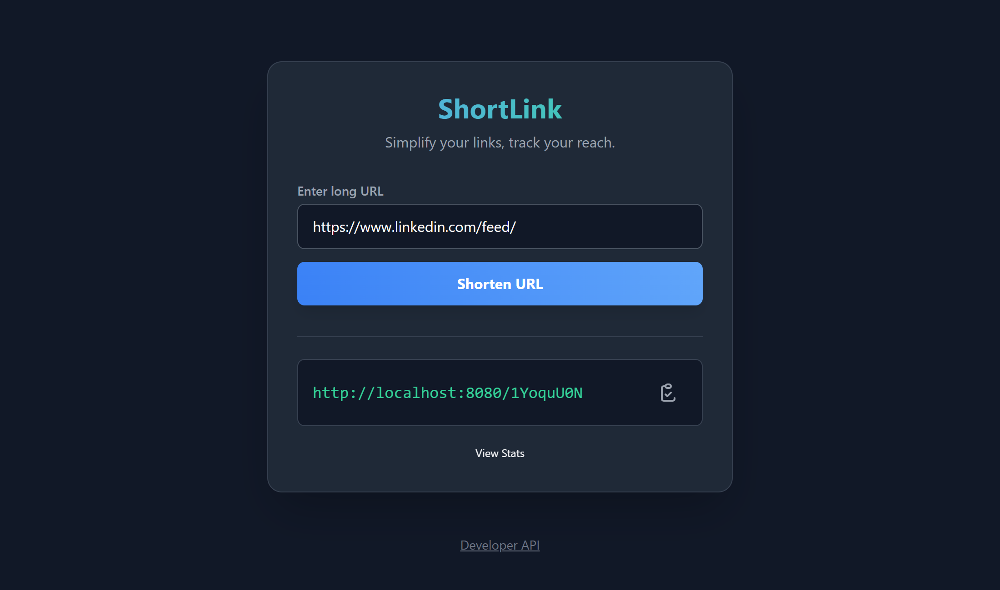
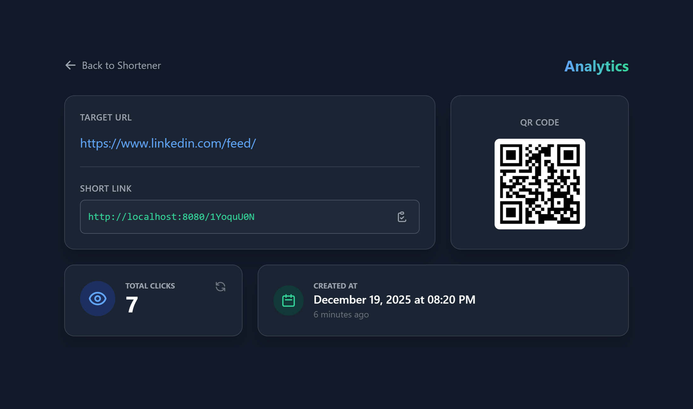
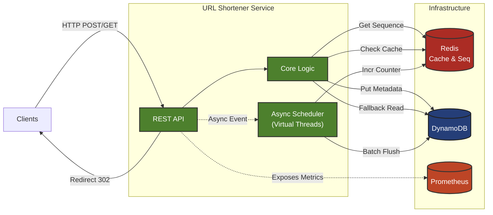

# ShortLink - High-Scale URL Shortener


A production-grade, distributed URL shortening service designed for high throughput and low latency, employing **Write-Behind Caching**, **Deterministic, Non-Sequential ID Generation**, and **Virtual Threads** to handle massive concurrent traffic with minimal resource overhead.

<p align="center">
  
  
</p>

---

## 🏗 Architecture

This project demonstrates distributed system patterns suitable for large-scale deployments.



### Key Architectural Patterns

#### 1. Write-Behind Caching (Click Analytics)
Instead of writing to the database on every redirect (which creates a bottleneck), this system uses a **Write-Behind** strategy:
1.  **Atomic Increment:** Clicks are incremented instantly in Redis (`INCR`).
2.  **Dirty Tracking:** The specific short code is added to a Redis Set.
3.  **Batch Persistence:** A background scheduler (running on Virtual Threads) pops dirty codes in batches and flushes the aggregated counts to DynamoDB using atomic updates (`ADD clicks :inc`).
*   **Result:** The database load is decoupled from traffic spikes. 10,000 clicks/sec results in only a few DB write operations per minute.

#### 2. Deterministic "Random" ID Generation
To avoid database lookups for uniqueness checks and to prevent enumeration attacks (e.g., competitors guessing link volume by seeing sequential IDs like `abc1`, `abc2`), ShortLink uses a **Linear Congruential Generator** approach:
*   **Formula:** `(SequenceID * PRIME + SALT) % 2^64` encoded to Base62.
*   **Result:** A guaranteed unique, non-sequential, collision-free short code generated purely in memory (after fetching a sequence block).

#### 3. Java 25 & Virtual Threads
The application leverages Java 25 Virtual Threads (`Executors.newVirtualThreadPerTaskExecutor`) to efficiently handle blocking I/O (Redis and DynamoDB calls), enabling high concurrency with reduced thread management overhead.

---

## 🛠 Tech Stack

*   **Language:** Java 25 (LTS)
*   **Framework:** Spring Boot 4.0
*   **Database:** AWS DynamoDB
*   **Caching:** Redis (Sequence generation, Hot URL cache, Write-behind buffer)
*   **Concurrency:** Project Loom / Virtual Threads
*   **Observability:** Prometheus, Grafana, Micrometer
*   **Containerization:** Docker & Docker Compose

---

## 🚀 Getting Started

The project includes a fully containerized environment (App, Redis, DynamoDB Local, Prometheus, Grafana).

```bash
# Clone the repository
git clone https://github.com/William-Nogueira/spring-url-shortener.git

# Start the stack
docker-compose up -d --build
```

Access the services:
*   **Web UI:** [http://localhost:8080](http://localhost:8080)
*   **Swagger API:** [http://localhost:8080/swagger-ui/index.html](http://localhost:8080/swagger-ui/index.html)
*   **Grafana:** [http://localhost:3000](http://localhost:3000) (User: `admin` / Pass: `admin`)
*   **Prometheus:** [http://localhost:9090](http://localhost:9090)

---

## 📊 Observability & Metrics

The application exposes custom metrics via Micrometer to monitor business KPIs in real-time.

| Metric | Description |
| :--- | :--- |
| `business.urls.created` | Counter of total URLs shortened. |
| `http.server.requests` | Latency and throughput of API endpoints. |
| `executor.active` | Monitoring of Virtual Thread pool usage. |

---

## ⚙️ Configuration

Environment variables can be tuned in `docker-compose.yml`:

| Variable | Default | Description |
| :--- | :--- | :--- |
| `APP_SALT` | `SECRET` | Seed for the ID generation obfuscation. |
| `DYNAMO_ENDPOINT` | `http://dynamodb-local:8000` | Target DynamoDB instance. |
| `SPRING_DATA_REDIS_HOST` | `redis` | Redis host address. |

---

## 🧪 Testing

Tests use Testcontainers to validate Redis and DynamoDB integration in an environment close to production.

To run the unit and integration tests (using TestContainers):

```bash
./mvnw test
```

---

## 📄 License

This project is licensed under the MIT License - see the [LICENSE](LICENSE) file for details.